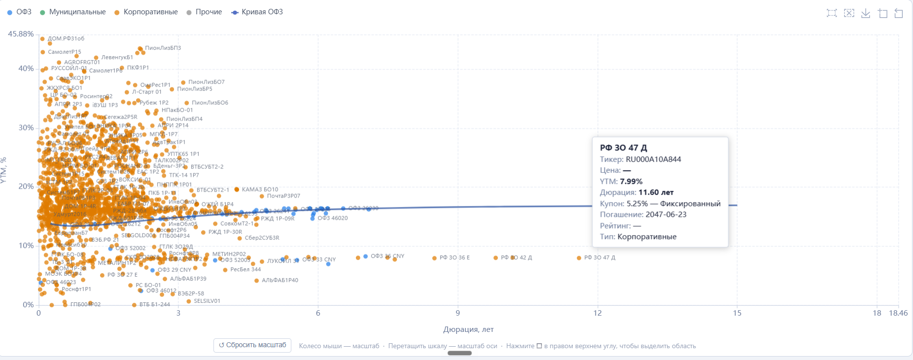

# Карта рынка облигаций — MOEX

Интерактивная scatter-диаграмма **YTM vs Дюрация** для всех ликвидных облигаций Московской биржи. Помогает быстро оценить соотношение доходности и срока по всему рынку, найти интересные бумаги и сравнить их с кривой ОФЗ.

**[Открыть приложение →](https://alexrazumovich.github.io/moex-bond-map/)**



---

## Возможности

- **Карта рынка** — scatter-диаграмма YTM vs Дюрация, цвет точки = кредитный рейтинг (4 зоны: зелёный AA+, жёлтый A, синий BBB, красный BB и ниже)
- **Кривая ОФЗ** — официальная кривая бескупонной доходности MOEX (модель Нельсона-Сигеля-Свенссона)
- **Фильтры** — тип эмитента, тип купона, рейтинг, валюта
- **Поиск** — по тикеру, названию, ISIN; режимы «Подсветить» и «Только результаты»
- **Drill-down** — выделите прямоугольник для детального просмотра группы бумаг
- **Карточка облигации** — детали по клику: YTM, дюрация, купон, рейтинг, дата погашения
- **Портфели** — отображение позиций поверх карты; добавление вручную или импорт из Excel (corpbonds.ru)
- **Личный кабинет** — авторизация по email, портфели хранятся в облаке и доступны с любого устройства

## Данные

| Источник | Что |
|---|---|
| [MOEX ISS REST API](https://iss.moex.com/) | Котировки, YTM, дюрация — обновляются при каждом открытии |
| [corpbonds.ru](https://corpbonds.ru/) | Кредитные рейтинги (АКРА, Эксперт РА, НКР, НРА) — обновляются каждую ночь автоматически |

## Стек

- Vanilla JS + [ECharts 5.5](https://echarts.apache.org/)
- [Supabase](https://supabase.com/) — авторизация + PostgreSQL для портфелей
- [SheetJS](https://sheetjs.com/) — парсинг Excel в браузере
- GitHub Pages — хостинг
- GitHub Actions — ночное обновление рейтингов

## Локальная разработка

```bash
# Клонировать репозиторий
git clone https://github.com/Alexrazumovich/moex-bond-map.git
cd moex-bond-map

# Запустить локальный сервер (нужен для загрузки ratings.json и сохранения портфелей)
python server.py
# → http://localhost:8001
```

> **Важно:** открывать через `http://localhost:8001`, а не напрямую как файл — браузер блокирует fetch-запросы из `file://`.

## Обновление рейтингов вручную

```powershell
# Windows PowerShell
.\fetch_ratings_corpbonds.ps1
```

```bash
# Linux / GitHub Actions
pip install requests
python fetch_ratings.py
```

После обновления `ratings.json` — `git add ratings.json && git commit && git push`.

## Лицензия

MIT
